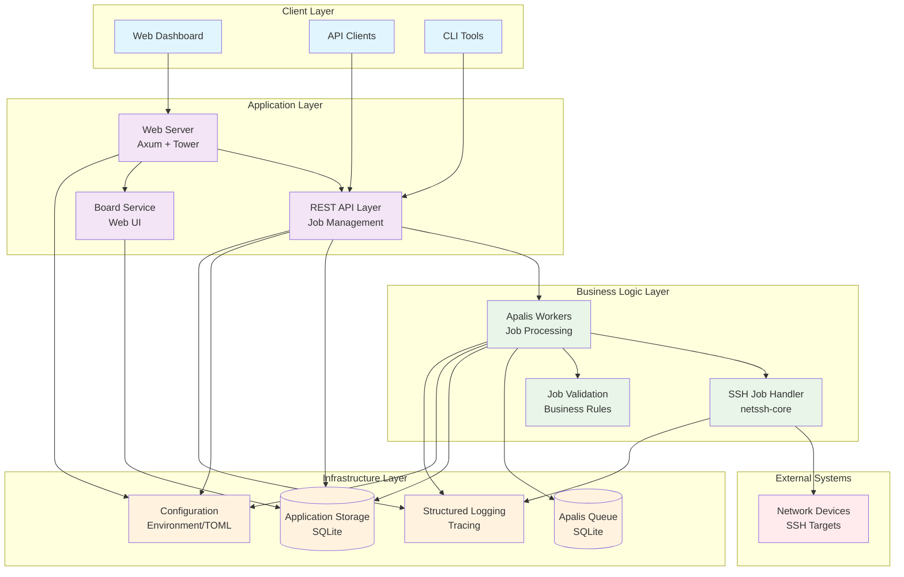
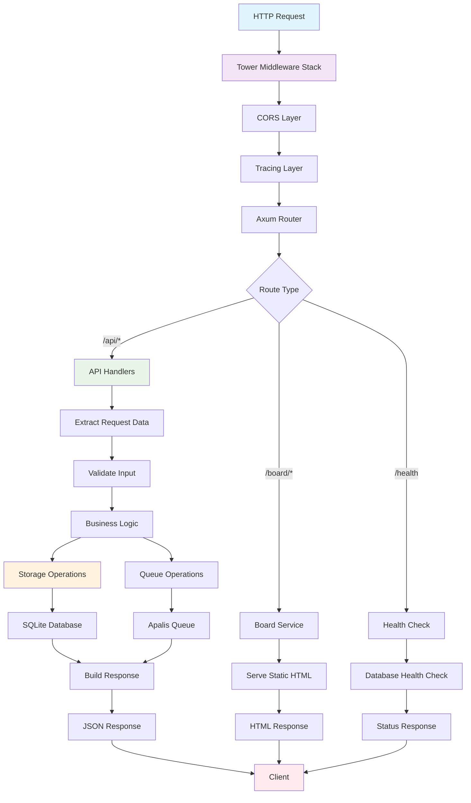
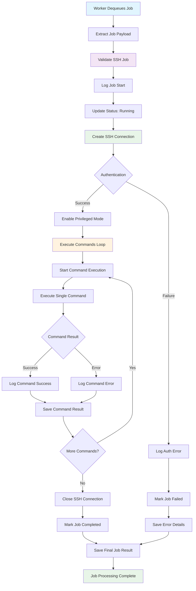
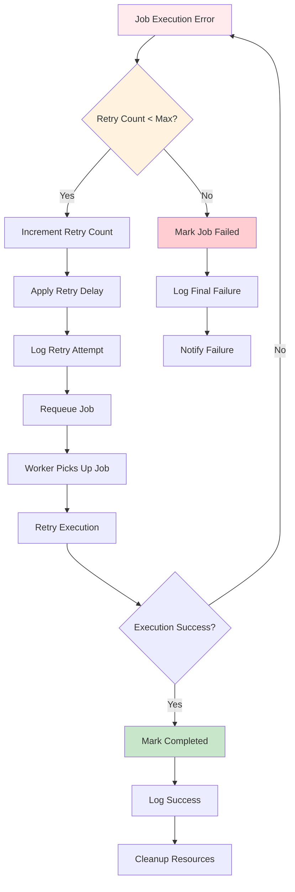
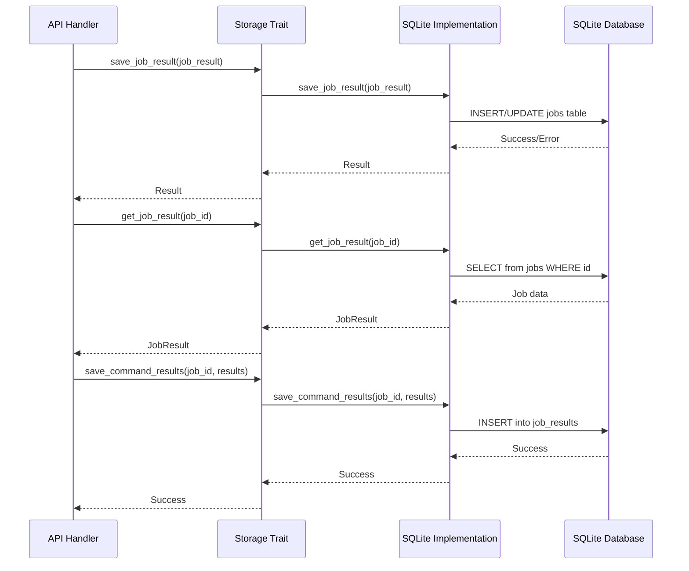
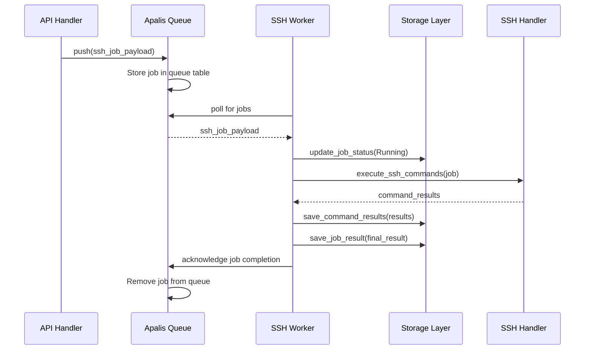
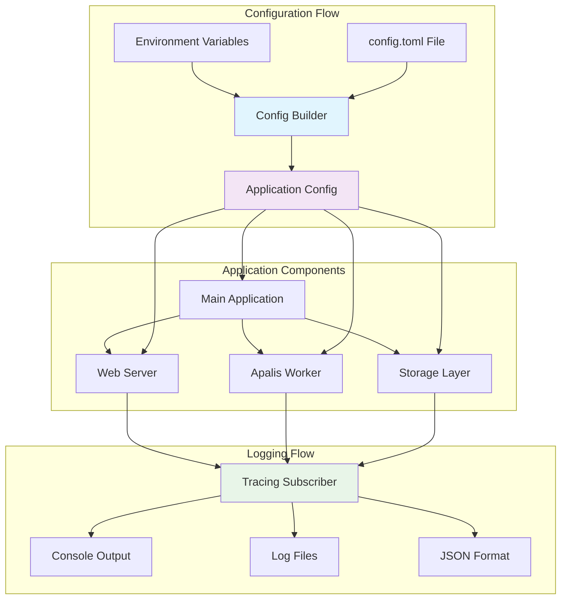
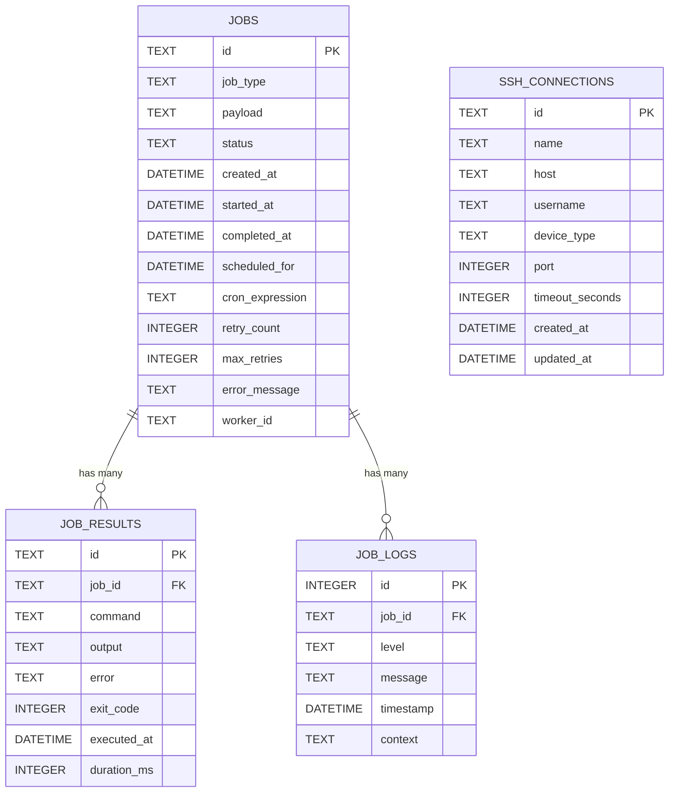
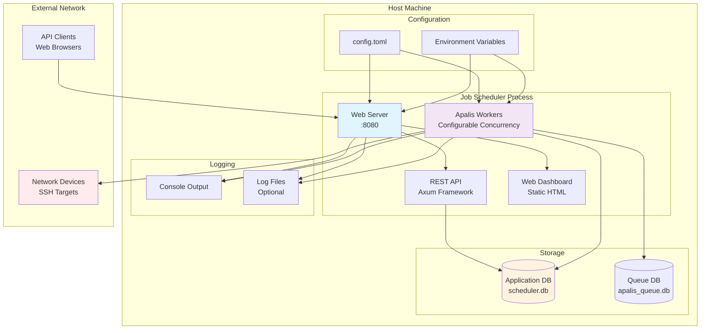

# Job Scheduler Architecture Documentation

## Table of Contents
1. [System Architecture Overview](#system-architecture-overview)
2. [User Flow Diagrams](#user-flow-diagrams)
3. [Code Flow Diagrams](#code-flow-diagrams)
4. [Component Interaction Diagrams](#component-interaction-diagrams)
5. [Database Schema](#database-schema)
6. [Deployment Architecture](#deployment-architecture)

## System Architecture Overview

The Job Scheduler is a distributed system built with Rust, featuring a modular architecture that separates concerns across multiple layers.



### Key Components

- **Web Server**: Axum-based HTTP server with middleware for CORS, tracing, and routing
- **REST API**: RESTful endpoints for job management, health checks, and connection profiles
- **Apalis Workers**: Background job processing with configurable concurrency
- **SSH Handler**: Network device command execution using netssh-core library
- **Storage Layer**: Abstracted storage with SQLite implementation
- **Web Dashboard**: Real-time job monitoring and management interface

## User Flow Diagrams

### SSH Job Creation and Execution Flow

```mermaid
sequenceDiagram
    participant User
    participant WebUI as Web Dashboard
    participant API as REST API
    participant Storage as SQLite Storage
    participant Queue as Apalis Queue
    participant Worker as SSH Worker
    participant Device as Network Device
    
    User->>WebUI: Access Dashboard
    WebUI->>API: GET /api/jobs (load existing)
    API->>Storage: Query jobs
    Storage-->>API: Return job list
    API-->>WebUI: Job data
    WebUI-->>User: Display dashboard
    
    User->>API: POST /api/jobs (create SSH job)
    Note over API: Validate job payload
    API->>Storage: Save job record (pending)
    API->>Queue: Enqueue job for processing
    API-->>User: Return job ID
    
    Queue->>Worker: Dequeue job
    Worker->>Storage: Update status (running)
    Worker->>Device: SSH connect & authenticate
    Device-->>Worker: Connection established
    
    loop For each command
        Worker->>Device: Execute command
        Device-->>Worker: Command output
        Worker->>Storage: Save command result
    end
    
    Worker->>Device: Close SSH connection
    Worker->>Storage: Update job status (completed/failed)
    Worker->>Storage: Save final job result
    
    WebUI->>API: GET /api/jobs (auto-refresh)
    API->>Storage: Query updated jobs
    Storage-->>API: Return updated list
    API-->>WebUI: Updated job data
    WebUI-->>User: Show job completion

### Job Monitoring and Management Flow

```mermaid
flowchart TD
    START([User Opens Dashboard]) --> LOAD[Load Dashboard]
    LOAD --> FETCH[Fetch Jobs via API]
    FETCH --> DISPLAY[Display Job List & Stats]

    DISPLAY --> REFRESH{Auto Refresh<br/>Every 30s}
    REFRESH -->|Yes| FETCH

    DISPLAY --> MANUAL[Manual Refresh Button]
    MANUAL --> FETCH

    DISPLAY --> SELECT[Select Job for Details]
    SELECT --> DETAILS[GET /api/jobs/:id]
    DETAILS --> LOGS[GET /api/jobs/:id/logs]
    LOGS --> SHOW[Show Job Details & Logs]

    DISPLAY --> DELETE[Delete Job]
    DELETE --> CONFIRM{Confirm Deletion}
    CONFIRM -->|Yes| API_DELETE[DELETE /api/jobs/:id]
    CONFIRM -->|No| DISPLAY
    API_DELETE --> FETCH

    style START fill:#e1f5fe
    style LOAD fill:#f3e5f5
    style DISPLAY fill:#e8f5e8
    style REFRESH fill:#fff3e0
    style SHOW fill:#e8f5e8
```

## Code Flow Diagrams

### Request Processing Flow



### SSH Job Execution Workflow



### Error Handling and Retry Mechanism



## Component Interaction Diagrams

### API Layer to Storage Layer Interaction



### Apalis Queue and Worker Interaction



### Configuration and Logging Integration



## Database Schema

### Entity Relationship Diagram



### Database Schema Details

**Jobs Table**: Core job metadata and status tracking
- Primary key: UUID as TEXT
- Status values: pending, running, completed, failed, cancelled, retrying
- Supports both immediate and scheduled execution
- Tracks retry attempts and error messages

**Job Results Table**: Individual command execution results
- Links to parent job via foreign key
- Stores command text, output, errors, and timing
- Supports multiple commands per job

**Job Logs Table**: Detailed logging for debugging and monitoring
- Structured logging with levels (info, warn, error, debug)
- Contextual information for troubleshooting
- Timestamped entries for audit trails

**SSH Connections Table**: Reusable connection profiles
- Named connection configurations
- Device type classification for protocol handling
- Audit trail with creation and update timestamps

## Deployment Architecture

### Single Node Deployment



### Configuration Options

The application supports flexible configuration through multiple sources:

```toml
# config.toml example
[database]
url = "sqlite:scheduler.db"
max_connections = 10

[server]
host = "127.0.0.1"
port = 8080

[worker]
concurrency = 4
timeout_seconds = 300

[board]
enabled = true
ui_path = "/board"
api_prefix = "/board/api"
auth_enabled = false

[logging]
level = "info"
file = "/var/log/scheduler.log"
format = "json"
rotation = "daily"
```

### Environment Variables

All configuration can be overridden using environment variables with the `SCHEDULER_` prefix:

- `SCHEDULER_DATABASE_URL`
- `SCHEDULER_SERVER_HOST`
- `SCHEDULER_SERVER_PORT`
- `SCHEDULER_WORKER_CONCURRENCY`
- `SCHEDULER_LOGGING_LEVEL`

### Process Management

The application runs as a single process with two main async tasks:
1. **Web Server**: Handles HTTP requests and serves the dashboard
2. **Worker Pool**: Processes jobs from the Apalis queue

Both tasks run concurrently using `tokio::select!` and can be gracefully shut down.

### Resource Requirements

**Minimum Requirements**:
- RAM: 64MB
- CPU: 1 core
- Disk: 100MB (plus log storage)
- Network: SSH access to target devices

**Recommended for Production**:
- RAM: 256MB
- CPU: 2+ cores
- Disk: 1GB+ (with log rotation)
- Network: Reliable connectivity to target devices

### Security Considerations

- **SSH Credentials**: Stored in database, consider encryption at rest
- **Network Access**: Requires SSH (port 22) access to target devices
- **Web Interface**: No authentication by default, enable auth for production
- **API Access**: No rate limiting implemented, consider reverse proxy
- **Database**: SQLite file permissions should be restricted

### Monitoring and Observability

- **Health Endpoint**: `/api/health` for load balancer checks
- **Structured Logging**: JSON format for log aggregation
- **Job Metrics**: Available through dashboard and API
- **Tracing**: Built-in request tracing for debugging

This architecture provides a solid foundation for network automation tasks while maintaining simplicity and reliability.
