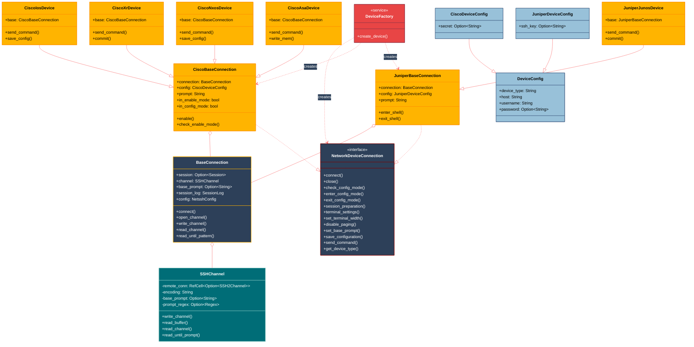

# Network SSH Architecture

## Component Colors Legend

- 🔵 **Core Classes** (Dark Blue) - Core framework components
- 🌊 **Transport Classes** (Teal) - Network transport layer components
- 🔴 **Service Classes** (Red) - High-level service components
- 🟡 **Vendor Classes** (Yellow) - Vendor-specific implementations
- 🔷 **Data Classes** (Light Blue) - Data structures and models

## Component Responsibilities

1. **NetworkDeviceConnection**: Core interface for network device interactions
2. **BaseConnection**: Low-level SSH connection and communication
3. **SSHChannel**: SSH channel management and I/O operations
4. **DeviceFactory**: Device connection factory
5. **CiscoBaseConnection**: Base implementation for Cisco devices
6. **JuniperBaseConnection**: Base implementation for Juniper devices
7. **Vendor-Specific Devices**: 
   - CiscoIosDevice: Cisco IOS implementation
   - CiscoXrDevice: Cisco XR implementation
   - CiscoNxosDevice: Cisco NXOS implementation
   - CiscoAsaDevice: Cisco ASA implementation
   - JuniperJunosDevice: Juniper JUNOS implementation
8. **Configuration Classes**:
   - DeviceConfig: Base configuration
   - CiscoDeviceConfig: Cisco-specific configuration
   - JuniperDeviceConfig: Juniper-specific configuration
