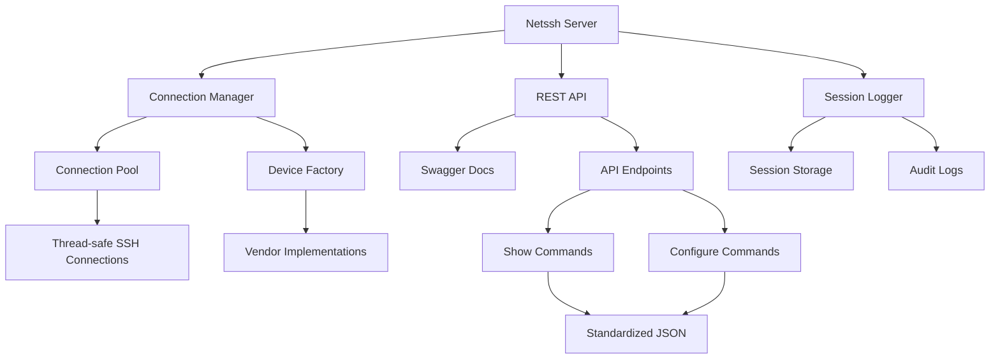
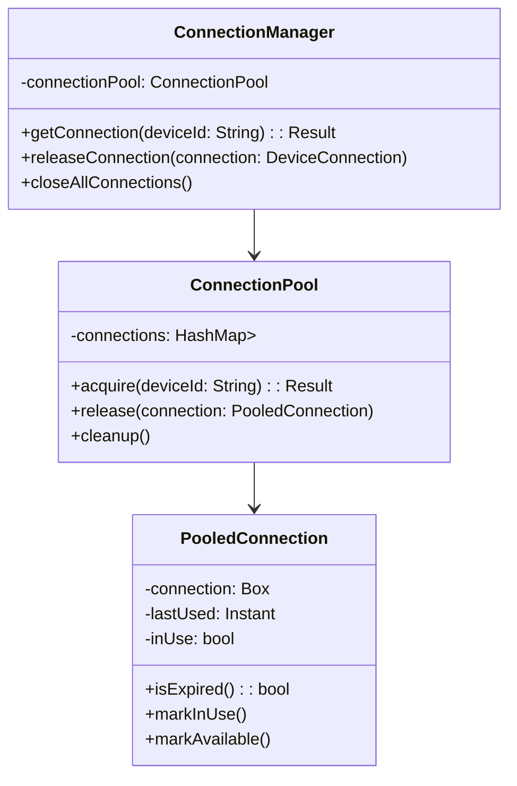
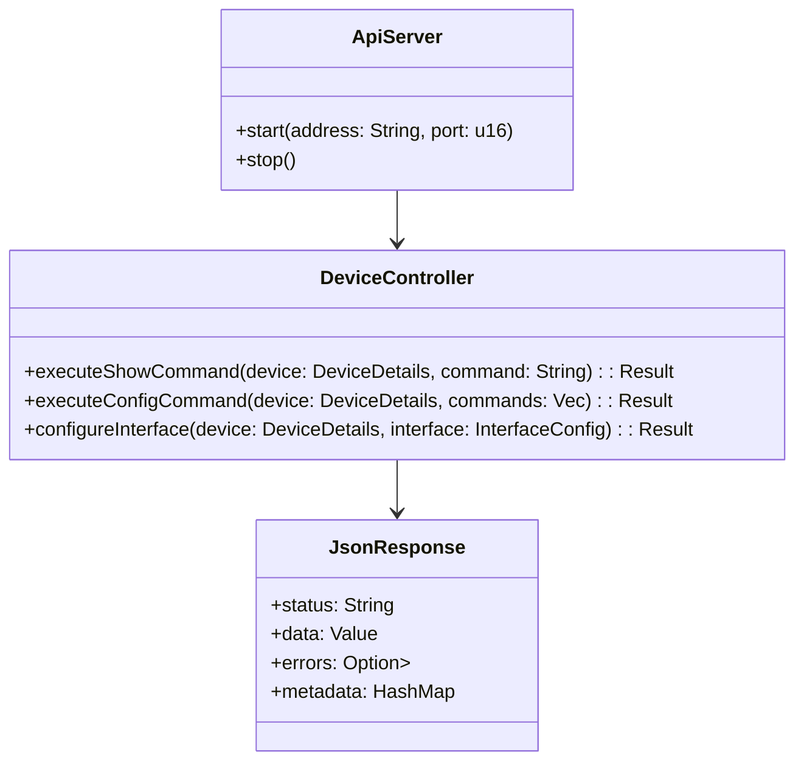
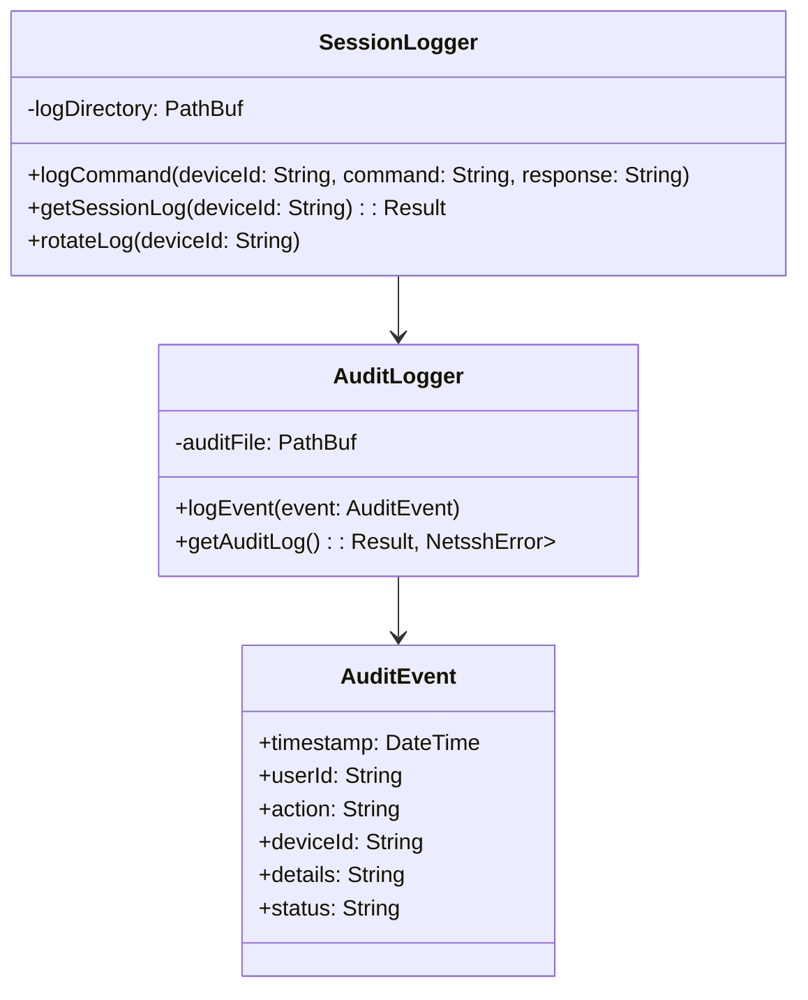

# Netssh-rs Server Implementation Plan

## Overview

This document outlines the implementation plan for enhancing the Netssh-rs project to support REST API endpoints for network device management, concurrent SSH connections, and standardized JSON responses.

## Architecture



## Components

### 1. Connection Manager

The Connection Manager will handle concurrent SSH connections to network devices, maintaining a pool of connections for efficient reuse.

**Key Features:**
- Thread-safe connection pool
- Connection lifecycle management
- Session timeout handling
- Automatic reconnection
- Connection health monitoring



### 2. REST API

The REST API will provide HTTP endpoints for interacting with network devices, supporting both show commands (read operations) and configuration commands (write operations).

**Key Features:**
- Standardized JSON responses
- Authentication and authorization
- Rate limiting
- Swagger documentation
- Error handling



### 3. Session Logger

The Session Logger will record all interactions with network devices, providing audit trails and debugging information.

**Key Features:**
- Detailed command logging
- Response capture
- Timestamping
- Log rotation
- Searchable logs



## API Design

### Endpoints

| Method | Endpoint | Description |
|--------|----------|-------------|
| POST | /api/execute/show | Execute a show command |
| POST | /api/execute/configure | Execute configuration commands |
| POST | /api/interfaces/configure | Configure an interface |
| GET | /health | Health check endpoint |

### Request/Response Examples

**Execute Show Command:**

Request:
```json
{
  "device": {
    "device_type": "cisco_ios",
    "host": "192.168.1.1",
    "username": "admin",
    "password": "cisco123",
    "port": 22,
    "timeout": 60,
    "secret": "enable_secret"
  },
  "command": "show ip interface brief"
}
```

Response:
```json
{
  "status": "success",
  "data": {
    "raw_output": "Interface                  IP-Address      OK? Method Status                Protocol\nGigabitEthernet0/0         192.168.1.1     YES NVRAM  up                    up\nGigabitEthernet0/1         unassigned      YES NVRAM  administratively down down",
    "parsed": {
      "interfaces": [
        {
          "name": "GigabitEthernet0/0",
          "ip_address": "192.168.1.1",
          "status": "up",
          "protocol": "up"
        },
        {
          "name": "GigabitEthernet0/1",
          "ip_address": "unassigned",
          "status": "administratively down",
          "protocol": "down"
        }
      ]
    }
  },
  "metadata": {
    "execution_time": "0.35s",
    "device_type": "cisco_ios"
  }
}
```

**Execute Configuration Commands:**

Request:
```json
{
  "device": {
    "device_type": "cisco_ios",
    "host": "192.168.1.1",
    "username": "admin",
    "password": "cisco123",
    "port": 22,
    "timeout": 60,
    "secret": "enable_secret"
  },
  "commands": [
    "interface GigabitEthernet0/1",
    "description WAN Connection",
    "ip address 10.0.0.1 255.255.255.0",
    "no shutdown"
  ]
}
```

Response:
```json
{
  "status": "success",
  "data": {
    "commands": [
      {
        "command": "interface GigabitEthernet0/1",
        "status": "success"
      },
      {
        "command": "description WAN Connection",
        "status": "success"
      },
      {
        "command": "ip address 10.0.0.1 255.255.255.0",
        "status": "success"
      },
      {
        "command": "no shutdown",
        "status": "success"
      }
    ]
  },
  "metadata": {
    "execution_time": "1.2s",
    "device_type": "cisco_ios"
  }
}
```

**Configure Interface:**

Request:
```json
{
  "device": {
    "device_type": "cisco_ios",
    "host": "192.168.1.1",
    "username": "admin",
    "password": "cisco123",
    "port": 22,
    "timeout": 60,
    "secret": "enable_secret"
  },
  "name": "GigabitEthernet0/1",
  "description": "WAN Connection",
  "ip_address": "10.0.0.1",
  "subnet_mask": "255.255.255.0",
  "admin_status": "up"
}
```

Response:
```json
{
  "status": "success",
  "data": {
    "interface": "GigabitEthernet0/1",
    "message": "Interface configured successfully"
  },
  "metadata": {
    "execution_time": "1.5s",
    "device_type": "cisco_ios"
  }
}
```

## Implementation Phases

### Phase 1: Core Infrastructure

1. Update dependencies in Cargo.toml
2. Implement Connection Manager and Connection Pool
3. Enhance error handling
4. Implement session logging improvements

### Phase 2: REST API Framework

1. Set up web server framework
2. Implement authentication middleware
3. Create base API controllers
4. Implement Swagger documentation

### Phase 3: Device Operations

1. Implement standardized JSON responses
2. Create show command endpoints
3. Create configuration command endpoints
4. Add interface management endpoints

### Phase 4: Testing and Documentation

1. Write unit tests for all components
2. Create integration tests
3. Complete API documentation
4. Create usage examples

## Dependencies

The following dependencies will be added to the project:

```toml
[dependencies]
# Existing dependencies...

# Web framework
actix-web = "4.3.1"
actix-rt = "2.8.0"

# Authentication
jsonwebtoken = "8.3.0"
argon2 = "0.5.0"

# API documentation
utoipa = { version = "3.3.0", features = ["actix_extras"] }
utoipa-swagger-ui = { version = "3.1.3", features = ["actix-web"] }

# Connection pooling
bb8 = "0.8.0"

# Enhanced logging
tracing = "0.1.37"
tracing-subscriber = { version = "0.3.16", features = ["env-filter"] }
tracing-appender = "0.2.2"

# Rate limiting
governor = "0.5.1"

# Testing
mockall = "0.11.4"
tokio-test = "0.4.2"
```

## Next Steps

1. Update Cargo.toml with new dependencies
2. Implement the Connection Manager
3. Set up the REST API framework
4. Create standardized JSON response structures